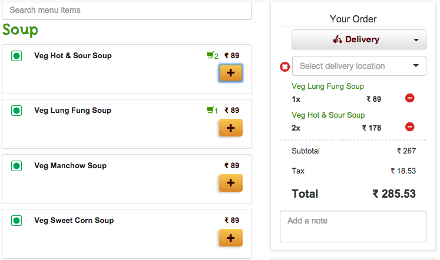

= Lab 03

[abstract]
In this lab you'll use controllers and services in Angular JS.

== Application
Have a look at the screenshot below. +

*  In the left side you see the menu, which is loaded dynamically.
*  When you click the _plus_ button you add the item to the cart in the right side.
* When you click the _minus_ button in the cart, the item quantity gets deducted
*  Compute the total automatically, when items are removed/added in the cart.
* Ignore "Search menu items", "Deliver","Select Delivery Location","Add note"

*  *Implement this application with the your controllers/services/modules written in separate _.js_ files*

* Don't worry too much about the look and feel of the page